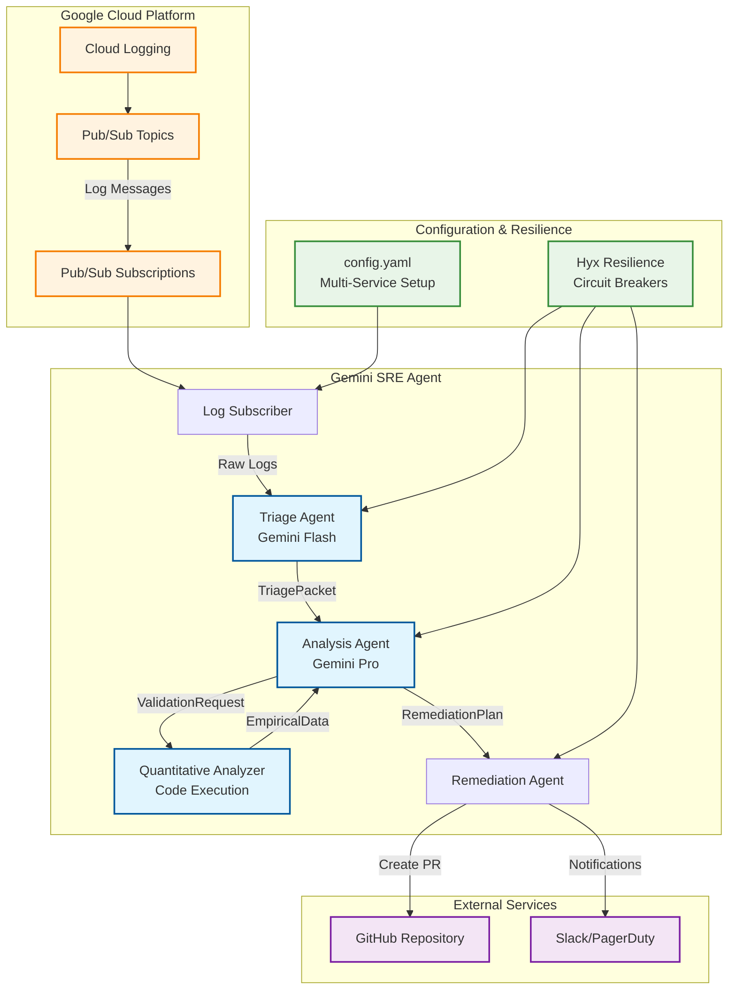

# Gemini SRE Agent for Cloud Log Monitoring

Welcome to the Gemini SRE Agent, an autonomous system designed to enhance your Google Cloud operations by intelligently monitoring logs and automating incident response. This project leverages the power of Google's Gemini models to bring advanced AI capabilities directly into your Site Reliability Engineering (SRE) workflows.

At its core, the Gemini SRE Agent acts as a proactive digital assistant, continuously observing your Google Cloud environment. When anomalies or critical events are detected in your logs, it doesn't just alert you; it initiates a structured process of analysis and proposes concrete remediation steps, culminating in automated GitHub Pull Requests. This approach aims to reduce manual toil, accelerate incident resolution, and improve the overall reliability of your cloud services.

Whether you're looking to streamline your incident management, gain deeper insights from your operational data, or simply explore the practical applications of generative AI in SRE, the Gemini SRE Agent offers a robust and extensible foundation. It's built with an emphasis on configurability, resilience, and clear observability, ensuring it can adapt to diverse cloud environments and operational needs.

Dive in to discover how this agent can transform your cloud log monitoring into an intelligent, automated, and resilient operation.

## System Architecture

The Gemini SRE Agent employs a sophisticated multi-model AI architecture for intelligent log monitoring and automated remediation:

### Multi-Model AI Strategy

The system leverages different Gemini models optimized for specific tasks:
- **Gemini Flash**: High-speed log triage and classification (cost-optimized)
- **Gemini Pro**: Deep analysis and code generation (accuracy-optimized)  
- **Code Execution**: Empirical validation and quantitative analysis

## Key Features

*   **Intelligent Log Analysis:** Leverages Gemini models for advanced pattern detection and root cause analysis in cloud logs.
*   **Automated Remediation:** Generates and submits GitHub Pull Requests for proposed fixes, integrating directly into your existing development workflows.
*   **Multi-Service & Multi-Repository Monitoring:** Designed to monitor logs from various services and manage remediation across different GitHub repositories.
*   **Built-in Resilience:** Incorporates robust resilience patterns (circuit breakers, retries, bulkheads, rate limiting) to ensure stable operation.
*   **Structured Observability:** Employs structured logging for easy integration with log aggregation and analysis systems.

## Documentation

For detailed information on the Gemini SRE Agent, please refer to the following documentation sections:

*   [**Quick Start Guide**](docs/QUICKSTART.md): Get the agent up and running in 15 minutes.
*   [**Architecture Overview**](docs/ARCHITECTURE.md): Understand the core components and data flow of the agent.
*   [**GCP Infrastructure Setup Guide**](docs/GCP_SETUP.md): Instructions for setting up necessary Google Cloud infrastructure.
*   [**Setup and Installation**](docs/SETUP_INSTALLATION.md): A comprehensive guide to getting the project up and running.
*   [**Configuration Guide**](docs/CONFIGURATION.md): Learn how to customize the agent's behavior via `config.yaml`.
*   [**Deployment Guide**](docs/DEPLOYMENT.md): Instructions for deploying the agent to Google Cloud Run and other environments.
*   [**Multi-Environment Guide**](docs/ENVIRONMENTS.md): Strategies for managing the agent across different environments.
*   [**Security Guide**](docs/SECURITY.md): Best practices and considerations for securing the agent.
*   [**Performance Tuning Guide**](docs/PERFORMANCE.md): Recommendations for optimizing agent performance and cost.
*   [**Operations Runbook**](docs/OPERATIONS.md): Guidelines for operating, monitoring, and maintaining the agent.
*   [**Troubleshooting Guide**](docs/TROUBLESHOOTING.md): Solutions to common issues.
*   [**Development Guide**](docs/DEVELOPMENT.md): Information for contributors, including testing, code style, and contributing.

## Getting Started (Quick Overview)

To quickly get started, ensure you have Python 3.12+ and `uv` installed. Clone the repository, install dependencies with `uv sync`, authenticate your `gcloud` CLI, and set your `GITHUB_TOKEN` environment variable. Then, explore `config/config.yaml` to define your monitoring services. You can run the agent locally with `python main.py` or deploy it to Cloud Run using the provided `deploy.sh` script.

## Contributing

We welcome contributions! Please see the [Development Guide](docs/DEVELOPMENT.md) for details on how to get involved.

## License

This project is licensed under the MIT License - see the [LICENSE](LICENSE) file for details.