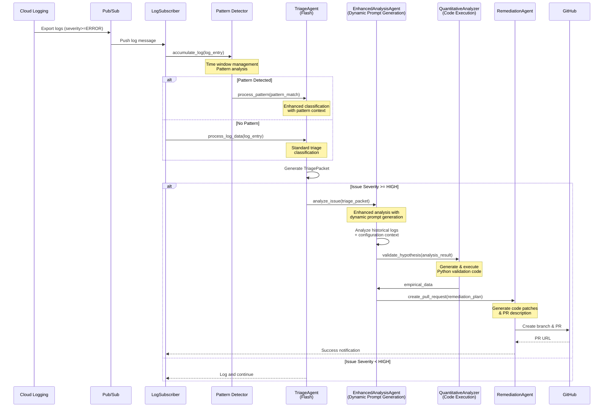
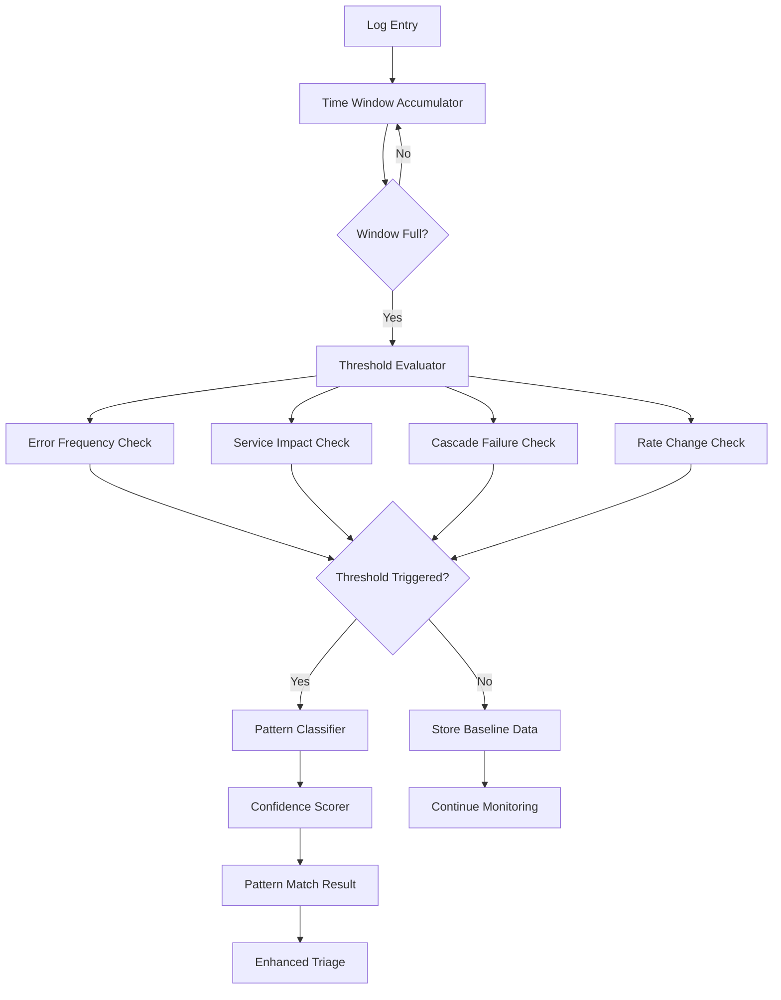

# Architecture Overview

The Gemini SRE Agent is designed with a modular and extensible architecture, enabling autonomous log monitoring, analysis, and remediation within Google Cloud environments. The system operates on a continuous, event-driven loop, leveraging Google's Gemini models for intelligent decision-making and the `hyx` library for robust resilience.

## Core Components

The agent's functionality is distributed across several key components, each with a specific role in the incident response workflow:

### 1. Log Ingestion (`LogIngestor`)
*   **Role:** Responsible for retrieving historical logs from Google Cloud Logging.
*   **Functionality:** Primarily used for initial data loading or backfilling purposes. In a real-time scenario, logs are typically streamed via Pub/Sub.

### 2. Log Subscription (`LogSubscriber`)
*   **Role:** Acts as the real-time entry point for log data.
*   **Functionality:** Subscribes to Google Cloud Pub/Sub topics where logs are exported from Cloud Logging. It receives, parses, and dispatches log entries for further processing via a configurable callback. Extracts `flow_id` from log `insertId` for complete pipeline traceability. Designed for continuous processing without fixed timeouts and includes comprehensive error handling with message acknowledgment patterns.

### 3. Triage Agent (`TriageAgent`)
*   **Role:** Performs rapid, preliminary analysis of incoming log data.
*   **Functionality:** Utilizes a **Gemini Flash model** for quick assessment. It identifies potential issues, assigns a preliminary severity score, and summarizes the findings into a structured `TriagePacket`. This acts as a crucial filtering step to prioritize critical events. Includes built-in retry mechanisms for model calls to enhance robustness. All operations include `flow_id` tracking for complete traceability.

### 4. Enhanced Analysis Agent (`EnhancedAnalysisAgent`)
*   **Role:** Conducts in-depth root cause analysis and generates comprehensive remediation plans using **revolutionary dynamic prompt generation**.
*   **Functionality:** Receives `TriagePacket`s from the `TriageAgent`. It employs an **enhanced multi-model approach** with **Gemini Pro for analysis** and **Gemini Flash for meta-prompt generation**. The system automatically selects the optimal prompting strategy:
    *   **Meta-Prompt Generation**: Uses Gemini Flash to create optimized prompts for Gemini Pro (AI teaching AI)
    *   **Specialized Templates**: Domain-specific prompts for database, API, security, and service errors
    *   **Adaptive Strategy Selection**: Automatically chooses the best approach based on issue complexity
    *   **Context-Aware Generation**: Incorporates repository structure, technology stack, and historical patterns
*   **Output:** A `RemediationPlan` with superior code quality, detailed root cause analysis, and production-ready fixes. Includes built-in retry mechanisms, comprehensive flow tracking, and multiple fallback layers for reliability.

### 5. Remediation Agent (`RemediationAgent`)
*   **Role:** Automates the implementation of proposed service code remediation actions.
*   **Functionality:** Receives `RemediationPlan`s and interacts with GitHub to create branches, commit service code changes, and submit Pull Requests. Features idempotent branch creation for retry scenarios and extracts file paths from code patch comments. Integrates AI-driven insights into the development workflow with human-in-the-loop validation. All GitHub operations include comprehensive flow tracking.

### 6. Quantitative Verification Agent (`QuantitativeAnalyzer`)
*   **Role:** Provides empirical validation of analysis findings through automated code execution.
*   **Implementation:** Uses Gemini API's Code Execution capability to:
    *   Generate Python code for precise error rate calculations
    *   Validate hypotheses with statistical analysis
    *   Perform quantitative verification of findings
*   **Integration:** Works in conjunction with AnalysisAgent to provide data-driven validation of AI analysis results.

### 7. Pattern Detection System (`pattern_detector`)
*   **Role:** Advanced pattern recognition system for proactive incident detection and analysis.
*   **Components:**
    *   **TimeWindow Management:** Accumulates logs into sliding time windows for temporal analysis
    *   **Threshold Evaluator:** Applies smart thresholds (frequency, rate, service impact, cascade detection)
    *   **Pattern Classifier:** Identifies specific failure patterns (cascade failures, service degradation, traffic spikes, configuration issues, dependency failures, resource exhaustion, sporadic errors)
    *   **Confidence Scorer:** Provides sophisticated confidence scoring with 15+ factors including temporal patterns, service correlation, error consistency, and baseline deviations
    *   **Baseline Tracker:** Maintains dynamic baselines for anomaly detection
*   **Integration:** Enhances TriageAgent with proactive pattern detection capabilities, enabling early warning systems and more accurate incident classification.

### 8. Enhanced Prompt Generation System
*   **Role:** Revolutionary AI-powered prompt generation that automatically creates context-aware, specialized prompts for optimal code generation.
*   **Components:**
    *   **Adaptive Prompt Strategy**: Intelligently selects between meta-prompt, specialized, or generic approaches based on issue complexity
    *   **Meta-Prompt Generator**: Uses Gemini Flash to generate optimized prompts for Gemini Pro (AI teaching AI approach)
    *   **Specialized Templates**: Domain-specific prompts for database errors, API failures, security issues, and service problems
    *   **Context Builder**: Constructs comprehensive context from issue details, repository structure, and historical patterns
    *   **Validation & Refinement**: Implements iterative refinement with feedback loops and fallback mechanisms
*   **Benefits:**
    *   **Superior Code Quality**: Context-aware generation with domain expertise
    *   **Adaptive Intelligence**: Automatic strategy selection without manual intervention
    *   **Cost Optimization**: Smart caching and similarity matching reduce API costs
    *   **Reliability**: Multiple fallback layers ensure system stability
*   **Integration:** Seamlessly integrated with the Enhanced Analysis Agent, providing the foundation for all code generation operations.

## Flow Tracking System

The system implements comprehensive end-to-end traceability using standardized identifiers:

*   **`flow_id`**: Extracted from the original log's `insertId`, tracks a single log entry through the entire pipeline
*   **`issue_id`**: Generated during triage analysis, identifies a specific issue/incident across all components

Every log message uses standardized prefixes (`[LOG_INGESTION]`, `[TRIAGE]`, `[ANALYSIS]`, `[REMEDIATION]`, `[ERROR_HANDLING]`) with both identifiers for complete operational visibility. For detailed information on using this system for troubleshooting and monitoring, see [LOGGING.md](LOGGING.md) and [TROUBLESHOOTING.md](TROUBLESHOOTING.md).

## Data Flow and Interaction

The agent operates in a continuous feedback loop with complete flow tracking:

### Detailed Process Flow

1.  **Logs to Pub/Sub:** Google Cloud Logging is configured to export relevant log streams to designated Pub/Sub topics.
2.  **Subscriber Activation:** The `main.py` orchestrator launches an asynchronous task for each configured service. The `LogSubscriber` within each task listens to its respective Pub/Sub topic. Upon receiving a new log message, it triggers an asynchronous processing pipeline via a callback.
3.  **Triage & Analysis Pipeline:** The received log data is first sent to the `TriageAgent`. If a significant issue is identified, the resulting `TriagePacket` is then passed to the `AnalysisAgent` for deeper investigation. Both agents incorporate retry logic for their Gemini model interactions. The `AnalysisAgent` may also interact with the `QuantitativeAnalyzer` for empirical validation of its findings.
4.  **Remediation Trigger:** Once the `AnalysisAgent` generates a `RemediationPlan`, it is forwarded to the `RemediationAgent`.
5.  **GitHub Integration:** The `RemediationAgent` interacts with the configured GitHub repository to create a new branch, commit the proposed changes (code patches, IaC fixes), and open a Pull Request. This PR serves as a critical human-in-the-loop checkpoint for reviewing and approving automated remediation.

## Multi-Service and Multi-Repository Design

The agent is designed to monitor multiple services concurrently. This is achieved through a flexible configuration (`config.yaml`) that allows defining a list of services, each with its own GCP project, location, and Pub/Sub subscription. Furthermore, each service can optionally override the default GitHub repository settings, enabling remediation actions to be directed to different repositories as needed. This modularity ensures scalability and adaptability across diverse microservice architectures.

## Pattern Detection Architecture

The Pattern Detection System operates as a sophisticated multi-layer analysis engine with the following architecture:

### Pattern Detection Layers

1. **Time Window Management**
   - Sliding time windows (configurable duration)
   - Log accumulation and temporal organization
   - Window expiration and processing triggers

2. **Smart Threshold Evaluation**
   - **Error Frequency:** Absolute count thresholds with service grouping
   - **Error Rate:** Percentage increase from dynamic baselines
   - **Service Impact:** Multi-service failure detection
   - **Cascade Failure:** Cross-service correlation analysis
   - **Severity Weighted:** Weighted scoring by log severity levels

3. **Pattern Classification**
   - **Sporadic Errors:** Random distributed failures
   - **Service Degradation:** Single service performance issues
   - **Cascade Failure:** Multi-service dependency chains
   - **Traffic Spike:** Volume-induced system stress
   - **Configuration Issue:** Deployment-related problems
   - **Dependency Failure:** External service problems
   - **Resource Exhaustion:** Memory/CPU/storage limits

4. **Advanced Confidence Scoring**
   - 15+ quantitative factors including:
     - Temporal concentration and correlation
     - Service distribution and cross-correlation
     - Error consistency and message similarity
     - Baseline deviation and trend analysis
     - Resource utilization and deployment correlation
   - Configurable weighting and decay functions
   - Multi-level confidence assessment (VERY_LOW to VERY_HIGH)

## Resilience and Observability

*   **Resilience:** Critical operations within the agents are wrapped with resilience patterns (retries, circuit breakers, bulkheads, rate limiting) using the `hyx` library. Additionally, `asyncio.wait_for()` is used to enforce timeouts on asynchronous operations, ensuring the system remains stable and responsive even under adverse conditions like transient network issues, API rate limits, or service outages.
*   **Structured Logging:** All components utilize a centralized structured logging framework with comprehensive flow tracking. The system implements complete end-to-end traceability using `flow_id` (from log `insertId`) and `issue_id` parameters that flow through all subsystems. For detailed information on the logging format and flow tracking system, see [LOGGING.md](LOGGING.md).
