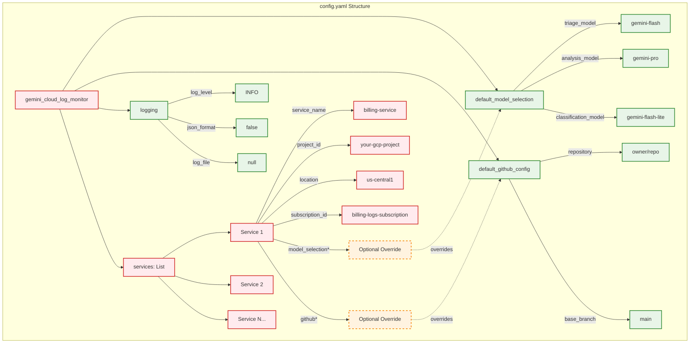

# Configuration Guide

The Gemini SRE Agent's behavior is highly configurable through the `config/config.yaml` file. This guide details the structure and options available to tailor the agent to your specific monitoring and remediation needs.

## `config/config.yaml` Structure

The main configuration file is organized under the `gemini_cloud_log_monitor` key, containing global defaults and a list of services to monitor.



### Configuration Hierarchy

The configuration follows a hierarchical structure where:
- **Global defaults** apply to all services unless overridden
- **Service-specific overrides** take precedence for individual services
- **Optional fields** can be omitted to use system defaults

```yaml
gemini_cloud_log_monitor:
  default_model_selection:
    triage_model: "gemini-flash"
    analysis_model: "gemini-pro"
    classification_model: "gemini-flash-lite"

  default_github_config:
    repository: "owner/repo"
    base_branch: "main"

  logging:
    log_level: "INFO"
    json_format: false
    log_file: null # e.g., "/var/log/gemini-sre-agent.log"

  services:
    - service_name: "billing-service"
      project_id: "your-gcp-project"
      location: "us-central1"
      subscription_id: "billing-logs-subscription"
      # Optional: Override default model_selection or github for this service
      # model_selection:
      #   triage_model: "gemini-flash-experimental"
      # github:
      #   repository: "owner/billing-repo" # Can be a different repo for this service

    - service_name: "auth-service"
      project_id: "your-gcp-project"
      location: "us-central1"
      subscription_id: "auth-logs-subscription"
      # This service will use default_model_selection and default_github_config
```

## Configuration Sections

### `default_model_selection`

This section defines the global default Gemini models to be used by the Triage and Analysis agents. These models will be used for any service that does not specify its own `model_selection` override.

*   **`triage_model`** (`str`): The name of the Gemini model to use for initial log triage (e.g., `gemini-flash`). This model should be optimized for speed and cost-efficiency.
*   **`analysis_model`** (`str`): The name of the Gemini model to use for deep root cause analysis and remediation plan generation (e.g., `gemini-pro`). This model should be optimized for reasoning and complex problem-solving.
*   **`classification_model`** (`str`): The name of the Gemini model to use for log classification (e.g., `gemini-flash-lite`).

### `default_github_config`

This section specifies the global default GitHub repository details for automated Pull Request generation. These settings apply to any service that does not provide its own `github` override.

*   **`repository`** (`str`): The GitHub repository name in `owner/repo` format (e.g., `my-org/my-cloud-services`).
*   **`base_branch`** (`str`): The default base branch for pull requests (e.g., `main`, `develop`).

### `logging`

This section controls the global logging behavior of the agent. These settings apply to all components unless explicitly overridden within the code (which is not currently supported).

*   **`log_level`** (`str`): The minimum logging level to capture. Valid options include `DEBUG`, `INFO`, `WARN`, `ERROR`, `FATAL`. `INFO` is recommended for production environments.
*   **`json_format`** (`bool`): If `true`, logs will be formatted as machine-readable JSON. This is highly recommended for production environments for easy ingestion into log aggregation systems. If `false`, logs will be human-readable.
*   **`log_file`** (`str` or `null`): The absolute path to a file where logs should be written. If set to `null`, logs will only be sent to the console (standard output).

### `services`

This is a **list** of `ServiceMonitorConfig` objects, where each object defines the monitoring and remediation settings for a specific Google Cloud service. This allows the agent to monitor multiple distinct services concurrently.

Each service configuration object has the following properties:

*   **`service_name`** (`str`): A unique, human-readable name for the service being monitored (e.g., `billing-service`, `user-auth-api`). This is used for identification and logging.
    *   **Validation:** Must be between 1 and 50 characters long.
*   **`project_id`** (`str`): The Google Cloud project ID where the service's logs reside and where Vertex AI models will be accessed for this service.
    *   **Validation:** Must be between 6 and 30 characters long, start with a lowercase letter, contain only lowercase letters, numbers, and hyphens, and end with a lowercase letter or number.
*   **`location`** (`str`): The GCP region where Vertex AI models will be interacted with for this service (e.g., `us-central1`, `europe-west1`).
    *   **Validation:** Must contain only lowercase letters, numbers, and hyphens.
*   **`subscription_id`** (`str`): The ID of the Pub/Sub subscription from which the agent will pull log messages for this specific service. This subscription should be configured to receive logs exported from Google Cloud Logging.
    *   **Validation:** Must be at least 1 character long.
*   **`model_selection`** (`Optional[ModelSelection]`): An optional override for the `default_model_selection` for this specific service. If provided, the models specified here will be used instead of the global defaults for this service's triage and analysis.
*   **`github`** (`Optional[GitHubConfig]`): An optional override for the `default_github_config` for this specific service. If provided, the repository and base branch specified here will be used for creating pull requests related to this service, allowing remediation actions to target different repositories.

## Example Scenarios

### Monitoring Multiple Services in the Same Repository

If you have several microservices that all reside in the same GitHub repository and use the same set of Gemini models for analysis, your `services` configuration might look like this:

```yaml
services:
  - service_name: "frontend-service"
    project_id: "my-gcp-project"
    location: "us-central1"
    subscription_id: "frontend-logs-sub"

  - service_name: "backend-api"
    project_id: "my-gcp-project"
    location: "us-central1"
    subscription_id: "backend-logs-sub"

  # ... other services
```

In this case, both `frontend-service` and `backend-api` will inherit the `default_model_selection` and `default_github_config`.

### Monitoring a Service with a Dedicated Repository

If a specific service (e.g., a legacy service) has its own dedicated GitHub repository for code and IaC, you can override the global GitHub configuration for that service:

```yaml
services:
  - service_name: "legacy-service"
    project_id: "old-gcp-project"
    location: "us-central1"
    subscription_id: "legacy-logs-sub"
    github:
      repository: "legacy-org/legacy-repo"
      base_branch: "master"

  # ... other services
```

### Using Different Models for a Specific Service

Perhaps a particular service requires a more specialized or experimental Gemini model for its analysis. You can override the model selection:

```yaml
services:
  - service_name: "experimental-service"
    project_id: "dev-gcp-project"
    location: "us-central1"
    subscription_id: "exp-logs-sub"
    model_selection:
      triage_model: "gemini-flash-experimental"
      analysis_model: "gemini-pro-experimental"
      classification_model: "gemini-flash-experimental"

  # ... other services
```

By leveraging these configuration options, the Gemini SRE Agent provides a flexible and powerful solution for managing diverse cloud environments.
