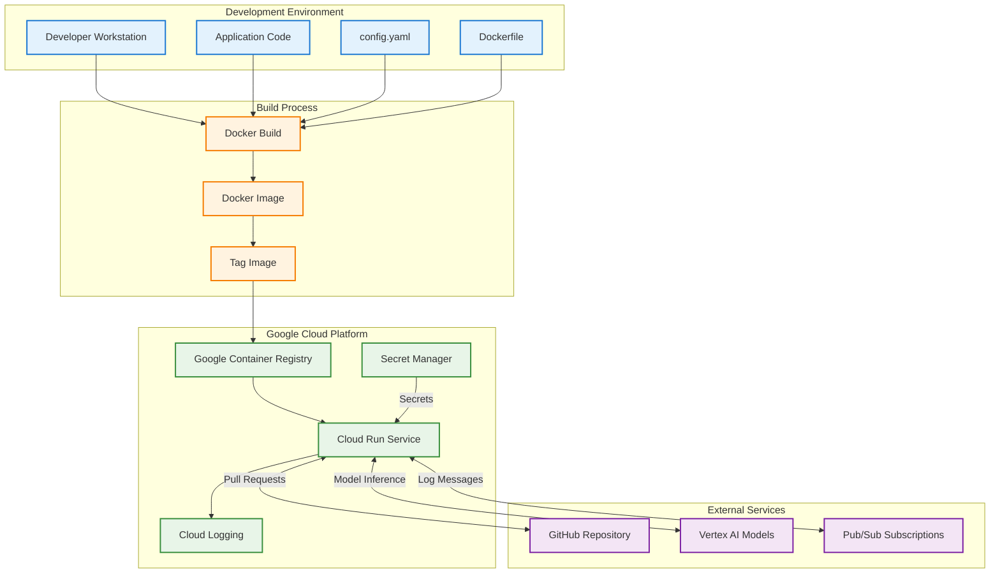

# Deployment Guide

This guide provides instructions for deploying the Gemini SRE Agent to Google Cloud Run, a fully managed compute platform for deploying containerized applications. While Cloud Run is the recommended deployment target for its simplicity and scalability, the provided `Dockerfile` allows for deployment to other container orchestration platforms like Google Kubernetes Engine (GKE) or custom environments.

## Deployment Flow Overview

The deployment process follows a straightforward containerization and Cloud Run deployment pattern:



## Containerization with Docker

The agent is packaged as a Docker image, ensuring a consistent and isolated runtime environment. The `Dockerfile` defines the steps to build this image:

```dockerfile
FROM python:3.12-slim-bookworm

WORKDIR /app

# Install uv
RUN pip install uv

# Copy dependency files
COPY pyproject.toml /app/

# Install dependencies
RUN uv sync

# Copy application code
COPY . /app

# Create non-root user for security
RUN useradd -m -u 1000 appuser && chown -R appuser:appuser /app
USER appuser

CMD ["python", "main.py"]
```

**Key aspects of the Dockerfile:**
*   **Base Image:** Uses `python:3.12-slim-bookworm` for a lightweight Python environment.
*   **Dependency Management:** Installs `uv` and then uses `uv sync` to install project dependencies defined in `pyproject.toml`.
*   **Non-Root User:** Creates a dedicated `appuser` and switches to it for enhanced security, following best practices for containerized applications.
*   **Entrypoint:** Sets `CMD ["python", "main.py"]` to run the main application script when the container starts.

## Deployment to Google Cloud Run

Google Cloud Run is an ideal platform for the Gemini SRE Agent due to its event-driven nature (triggered by Pub/Sub messages), automatic scaling (including scaling to zero when idle), and fully managed environment.

The `deploy.sh` script automates the process of building the Docker image, pushing it to Google Container Registry (GCR), and deploying it to Cloud Run.

### `deploy.sh` Script

```bash
#!/bin/bash

# Exit immediately if a command exits with a non-zero status.
set -e

# --- Configuration ---
PROJECT_ID="your-gcp-project-id" # Replace with your GCP Project ID
SERVICE_NAME="gemini-sre-agent"
REGION="us-central1" # Choose your desired GCP region
IMAGE_NAME="gcr.io/${PROJECT_ID}/${SERVICE_NAME}"

# --- Build Docker Image ---
echo "Building Docker image: ${IMAGE_NAME}"
docker build -t "${IMAGE_NAME}" .

# --- Push Docker Image to Google Container Registry ---
echo "Pushing Docker image to GCR..."
docker push "${IMAGE_NAME}"

# --- Deploy to Google Cloud Run ---
echo "Deploying to Google Cloud Run..."
gcloud run deploy "${SERVICE_NAME}" \
  --image "${IMAGE_NAME}" \
  --region "${REGION}" \
  --platform "managed" \
  --allow-unauthenticated \
  --project "${PROJECT_ID}" \
  --set-env-vars="GITHUB_TOKEN=${GITHUB_TOKEN}" \
  # Add other environment variables as needed, e.g., for specific service configs
  # --set-env-vars="SERVICE_CONFIG_PATH=/app/config/config.yaml" \
  # --update-secrets="GITHUB_TOKEN=GITHUB_TOKEN:latest" # Example for Secret Manager

echo "Deployment to Cloud Run complete!"
echo "Service URL: $(gcloud run services describe ${SERVICE_NAME} --region ${REGION} --project ${PROJECT_ID} --format='value(status.url)')"
```

### Deployment Steps

1.  **Configure `deploy.sh`:**
    Open `deploy.sh` and replace `"your-gcp-project-id"` with your actual GCP Project ID. Adjust `REGION` if desired.

2.  **Ensure `gcloud` CLI is configured:**
    Make sure your `gcloud` command-line tool is authenticated and configured for the correct GCP project. You can verify this with `gcloud config list`.

3.  **Set GitHub Token Environment Variable:**
    Before running the script, ensure your `GITHUB_TOKEN` environment variable is set in your shell. This token is passed to the Cloud Run service as an environment variable.
    ```bash
    export GITHUB_TOKEN="YOUR_GITHUB_PERSONAL_ACCESS_TOKEN"
    ```

4.  **Execute the deployment script:**
    ```bash
    chmod +x deploy.sh # Make the script executable
    ./deploy.sh
    ```

    The script will perform the following actions:
    *   Build a Docker image locally based on the `Dockerfile`.
    *   Tag the image with your project's Google Container Registry (GCR) path.
    *   Push the built Docker image to GCR.
    *   Deploy the image to Google Cloud Run, creating a new service or updating an existing one. It configures the service to allow unauthenticated invocations (necessary for Pub/Sub push subscriptions, or if you plan to trigger it via HTTP) and sets the `GITHUB_TOKEN` environment variable within the Cloud Run instance.

5.  **Verify Deployment:**
    After the script completes, it will output the service URL. You can also check the Cloud Run console in GCP to verify the deployment status.

## Production Considerations

For production deployments, consider the following:

*   **Secrets Management:** Instead of passing `GITHUB_TOKEN` directly as an environment variable in the `deploy.sh` script, use Google Secret Manager to securely store and retrieve sensitive credentials at runtime. The `deploy.sh` includes a commented-out example: `--update-secrets="GITHUB_TOKEN=GITHUB_TOKEN:latest"`.
*   **Service Account Permissions:** Ensure the Cloud Run service account has only the necessary IAM permissions (e.g., Pub/Sub Subscriber, Vertex AI User, Cloud Logging Viewer, and permissions to interact with GitHub if using a GitHub App or fine-grained PAT).
*   **Resource Allocation:** Adjust CPU and memory limits for your Cloud Run service based on expected workload and model inference requirements.
*   **Concurrency:** Configure the maximum number of concurrent requests a single container instance can handle.
*   **Monitoring and Alerting:** Set up Cloud Monitoring and Cloud Logging alerts for the Cloud Run service to track its health and performance.
*   **CI/CD Pipeline:** Integrate the build and deployment process into a Continuous Integration/Continuous Deployment (CI/CD) pipeline (e.g., Cloud Build, GitHub Actions) for automated and consistent deployments.
