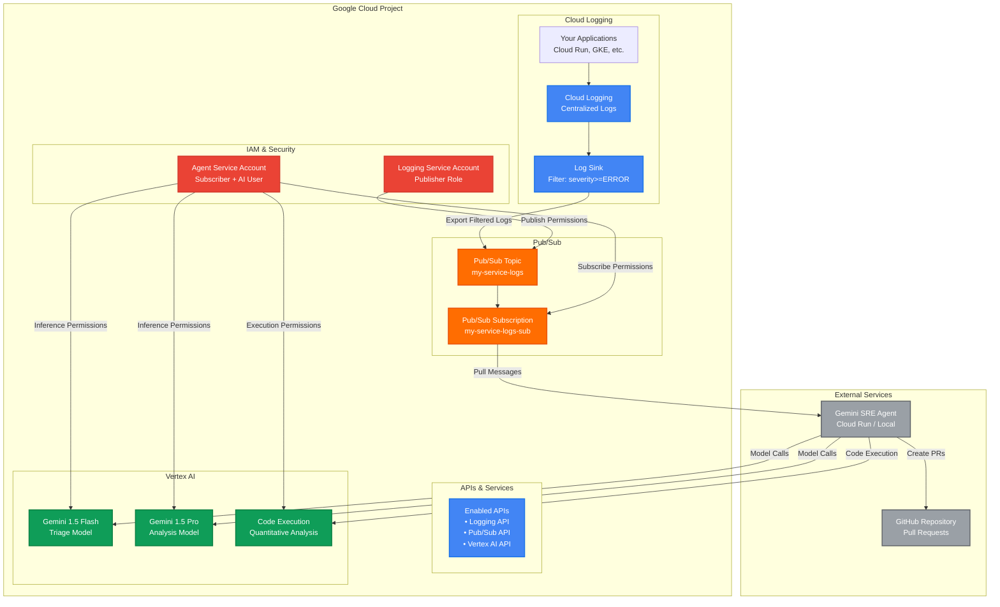

# GCP Infrastructure Setup Guide

This guide provides instructions for setting up the necessary Google Cloud Platform (GCP) infrastructure components required for the Gemini SRE Agent to function. This primarily involves configuring Google Cloud Logging to export logs to Pub/Sub, which the agent then consumes.

## GCP Infrastructure Overview

The following diagram shows the required GCP components and their relationships:



## 1. Enable Required APIs

Ensure the following APIs are enabled in your GCP project:

*   **Cloud Logging API**
*   **Cloud Pub/Sub API**
*   **Vertex AI API**

You You can enable them via the GCP Console (Navigation menu > APIs & Services > Enabled APIs & Services) or using the `gcloud` CLI:

```bash
gcloud services enable logging.googleapis.com
gcloud services enable pubsub.googleapis.com
gcloud services enable aiplatform.googleapis.com
```

## 2. Create Pub/Sub Topic and Subscription

For each service you wish to monitor, you need a dedicated Pub/Sub topic to receive log exports and a subscription for the Gemini SRE Agent to consume messages from that topic.

### Create a Topic

```bash
gcloud pubsub topics create projects/YOUR_GCP_PROJECT_ID/topics/YOUR_LOGS_TOPIC_NAME
```
Replace `YOUR_GCP_PROJECT_ID` with your project ID and `YOUR_LOGS_TOPIC_NAME` with a descriptive name (e.g., `my-service-logs`).

### Create a Subscription

```bash
gcloud pubsub subscriptions create projects/YOUR_GCP_PROJECT_ID/subscriptions/YOUR_LOGS_SUBSCRIPTION_NAME \
    --topic=projects/YOUR_GCP_PROJECT_ID/topics/YOUR_LOGS_TOPIC_NAME \
    --ack-deadline=600 \
    --message-retention-duration=7d
```
Replace `YOUR_LOGS_SUBSCRIPTION_NAME` with a name for your subscription (e.g., `my-service-logs-sub`). The `--ack-deadline` and `--message-retention-duration` are examples; adjust them based on your needs.

## 3. Configure Cloud Logging Sink

Create a Logging Sink to export logs from Cloud Logging to your newly created Pub/Sub topic. This sink will filter logs based on criteria you define.

### Determine Sink Service Account

First, you need to know the service account that the Logging Sink will use. This is typically in the format `service-<PROJECT_NUMBER>@gcp-sa-logging.iam.gserviceaccount.com`.

To get your project number:
```bash
gcloud projects describe YOUR_GCP_PROJECT_ID --format="value(projectNumber)"
```

### Grant Pub/Sub Publisher Role

Grant the Logging Sink's service account the `Pub/Sub Publisher` role on your Pub/Sub topic:

```bash
gcloud pubsub topics add-iam-policy-binding projects/YOUR_GCP_PROJECT_ID/topics/YOUR_LOGS_TOPIC_NAME \
    --member="serviceAccount:service-YOUR_PROJECT_NUMBER@gcp-sa-logging.iam.gserviceaccount.com" \
    --role="roles/pubsub.publisher"
```

### Create the Logging Sink

Now, create the sink, specifying the logs you want to export using a filter. For example, to export all logs with `ERROR` severity or higher from a specific service:

```bash
gcloud logging sinks create YOUR_SINK_NAME \
    pubsub.googleapis.com/projects/YOUR_GCP_PROJECT_ID/topics/YOUR_LOGS_TOPIC_NAME \
    --log-filter='resource.type="cloud_run_revision" AND resource.labels.service_name="my-service" AND severity>=ERROR' \
    --project=YOUR_GCP_PROJECT_ID
```

Replace `YOUR_SINK_NAME` with a name for your sink, and adjust the `--log-filter` to match the logs you want to monitor for your service. You can filter by `resource.type`, `severity`, `jsonPayload.field`, `textPayload`, etc.

## 4. Configure Service Account Permissions for the Agent

Ensure the service account (or your user account if running locally with `gcloud auth application-default login`) that the Gemini SRE Agent uses has the following IAM roles in your GCP project:

*   **`Pub/Sub Subscriber`** (`roles/pubsub.subscriber`): To pull messages from the Pub/Sub subscriptions.
*   **`Vertex AI User`** (`roles/aiplatform.user`): To interact with Vertex AI models.
*   **`Logging Viewer`** (`roles/logging.viewer`): To retrieve historical logs (if `LogIngestor` is used).

You can grant these roles via the GCP Console (IAM & Admin > IAM) or using the `gcloud` CLI:

```bash
gcloud projects add-iam-policy-binding YOUR_GCP_PROJECT_ID \
    --member="user:YOUR_GCP_ACCOUNT_EMAIL" \
    --role="roles/pubsub.subscriber"

gcloud projects add-iam-policy-binding YOUR_GCP_PROJECT_ID \
    --member="user:YOUR_GCP_ACCOUNT_EMAIL" \
    --role="roles/aiplatform.user"

gcloud projects add-iam-policy-binding YOUR_GCP_PROJECT_ID \
    --member="user:YOUR_GCP_ACCOUNT_EMAIL" \
    --role="roles/logging.viewer"
```
Replace `YOUR_GCP_ACCOUNT_EMAIL` with the email of the account running the agent.

## Next Steps

Once your GCP infrastructure is set up, proceed to the [Local Setup](SETUP_INSTALLATION.md#local-setup) section in the main installation guide to configure and run the Gemini SRE Agent.
