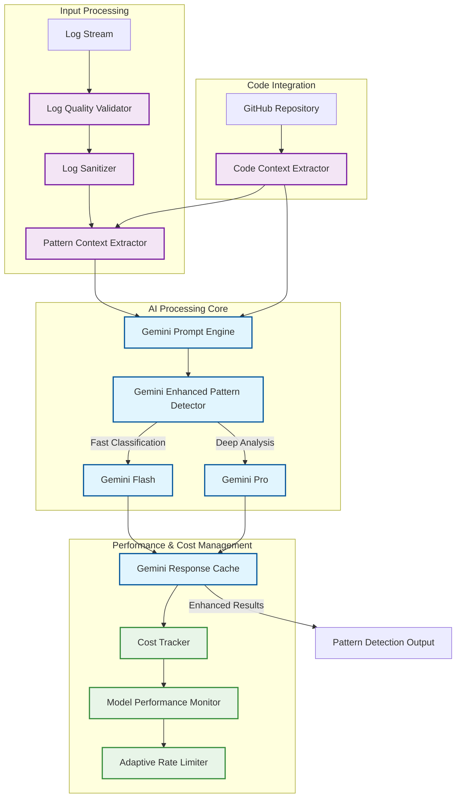

# Gemini ML Pattern Refinement System

The Gemini ML Pattern Refinement System is an advanced AI enhancement layer that transforms the traditional 4-layer pattern detection system into an intelligent, context-aware incident analysis pipeline. This system leverages Google's Gemini models to provide sophisticated pattern classification, confidence scoring, and automated code repository integration.

## Overview

The ML Pattern Refinement System enhances incident detection by:
- Providing AI-powered pattern analysis with structured prompting
- Incorporating code repository context for more accurate remediation
- Optimizing costs through intelligent response caching
- Ensuring data quality through validation and sanitization
- Monitoring performance and maintaining reliability

## System Architecture



## Core Components

### 1. GeminiPromptEngine

The prompt engine manages structured prompts and templates for Gemini model interactions.

**Key Features:**
- Template-based prompt generation with few-shot learning
- Structured output schemas using Pydantic models
- Context-aware prompt optimization
- Support for both classification and confidence assessment

**Configuration:**
```python
prompt_config = {
    "classification": {
        "model": "gemini-1.5-flash",
        "temperature": 0.3,
        "max_tokens": 2048
    },
    "confidence": {
        "model": "gemini-1.5-pro", 
        "temperature": 0.1,
        "max_tokens": 4096
    }
}
```

### 2. GeminiEnhancedPatternDetector

Ensemble pattern detector combining rule-based and AI-driven classification.

**Detection Strategy:**
- Primary: Rule-based pattern matching (fast, deterministic)
- Secondary: AI-powered classification (intelligent, context-aware)
- Fallback: Configurable behavior for AI failures

**Pattern Types Detected:**
- Cascading Failure
- Resource Exhaustion  
- Deployment Issue
- Dependency Failure
- Configuration Error
- Performance Degradation
- Security Incident

### 3. GeminiResponseCache

Intelligent caching system with similarity-based matching to optimize API costs.

**Caching Strategy:**
- Exact hash matching for identical contexts
- Similarity-based matching using weighted factors:
  - Service similarity (40% weight) - Jaccard index
  - Primary service match (20% weight)
  - Error patterns similarity (20% weight)
  - Timing analysis similarity (10% weight)
  - Service topology similarity (10% weight)

**Performance Benefits:**
- Up to 60% reduction in API costs
- Sub-millisecond cache retrieval
- TTL-based expiration (configurable)
- LRU eviction for memory management

### 4. LogQualityValidator

Pre-processing validation ensuring high-quality input for AI analysis.

**Quality Metrics:**
- **Completeness**: Essential fields populated (service_name, error_message, severity)
- **Noise Ratio**: Low-value logs (DEBUG/TRACE, short messages)
- **Consistency**: Message pattern uniformity
- **Duplicate Ratio**: Repeated message detection

**Thresholds (Configurable):**
```python
quality_thresholds = {
    "min_completeness": 0.80,    # 80% complete logs required
    "max_noise_ratio": 0.20,     # Max 20% noisy logs
    "min_consistency": 0.70,     # 70% pattern consistency  
    "max_duplicate_ratio": 0.30, # Max 30% duplicates
    "overall_quality_threshold": 0.75  # 75% overall quality
}
```

### 5. LogSanitizer

Comprehensive PII and sensitive data removal before AI processing.

**Sanitization Patterns:**
- IP addresses → `[IP_REDACTED]`
- Email addresses → `[EMAIL_REDACTED]`
- JWT tokens → `[TOKEN_REDACTED]`
- API keys (32+ chars) → `[API_KEY_REDACTED]`
- SSN patterns → `[SSN_REDACTED]`
- Phone numbers → `[PHONE_REDACTED]`
- Credit card numbers → `[CC_REDACTED]`
- Generic secrets → `[SECRET_REDACTED]`

**Security Features:**
- Pattern-based detection using regex
- Configurable replacement patterns
- Audit logging for all sanitization actions
- Validation to ensure complete sanitization

### 6. Performance & Cost Management

**CostTracker:**
- Real-time API usage monitoring
- Budget limits with configurable alerts
- Cost per model tracking
- Usage analytics and reporting

**ModelPerformanceMonitor:**
- Response time tracking
- Success/failure rate monitoring  
- Model drift detection
- Performance degradation alerts

**AdaptiveRateLimiter:**
- Circuit breaker pattern implementation
- Adaptive rate limiting based on API health
- Automatic backoff and recovery
- Per-model rate limiting

### 7. PatternContextExtractor

Extracts structured context from incident data with code repository integration.

**Context Elements:**
- Temporal patterns (burst detection, onset timing)
- Service interaction patterns
- Error characteristics and distributions
- Code changes context (recent commits, affected files)
- Static analysis findings
- Dependency health status

**Repository Integration:**
- Git commit analysis
- File change impact assessment
- Dependency vulnerability scanning
- Code quality metrics extraction

## Configuration

### Basic Configuration

```yaml
ml_pattern_refinement:
  enabled: true
  
  # Gemini API Configuration
  gemini:
    project_id: "your-project-id"
    location: "us-central1"
    models:
      classification: "gemini-1.5-flash"
      confidence: "gemini-1.5-pro"
  
  # Quality Validation
  log_quality:
    min_completeness: 0.80
    max_noise_ratio: 0.20
    min_consistency: 0.70
    max_duplicate_ratio: 0.30
    overall_threshold: 0.75
  
  # Response Caching
  cache:
    max_size: 1000
    ttl_hours: 24
    similarity_threshold: 0.85
  
  # Cost Controls
  cost_tracking:
    daily_budget_usd: 50.0
    alert_threshold: 0.80
    
  # Rate Limiting
  rate_limiting:
    requests_per_minute: 60
    circuit_breaker_threshold: 5
```

### Advanced Configuration

```yaml
ml_pattern_refinement:
  # Code Repository Integration
  code_integration:
    enabled: true
    repository_path: "/path/to/repo"
    analysis_depth: "shallow"  # shallow, medium, deep
    include_dependencies: true
    
  # Pattern Detection Tuning
  pattern_detection:
    ensemble_weight_ai: 0.7
    ensemble_weight_rules: 0.3
    confidence_threshold: 0.75
    fallback_strategy: "rules_only"  # rules_only, skip, best_effort
    
  # Performance Monitoring
  monitoring:
    performance_tracking: true
    drift_detection: true
    alert_on_degradation: true
    metrics_retention_days: 30
```

## Usage Examples

### Basic Pattern Detection

```python
from gemini_sre_agent.ml.gemini_enhanced_pattern_detector import GeminiEnhancedPatternDetector
from gemini_sre_agent.ml.schemas import PatternContext

# Initialize detector
detector = GeminiEnhancedPatternDetector()

# Create pattern context
context = PatternContext(
    primary_service="api-service",
    affected_services=["api-service", "db-service"],
    error_patterns={"rate": 0.05, "types": ["timeout", "connection"]}
)

# Detect pattern
result = await detector.detect_pattern(
    time_window=window,
    context=context
)

print(f"Pattern: {result.pattern_type}")
print(f"Confidence: {result.confidence:.2f}")
print(f"Reasoning: {result.reasoning}")
```

### Cache Usage Optimization

```python
from gemini_sre_agent.ml.gemini_response_cache import GeminiResponseCache

# Initialize cache
cache = GeminiResponseCache(
    max_cache_size=1000,
    ttl_hours=24,
    similarity_threshold=0.85
)

# Check cache before API call
cached_response = await cache.get_cached_response(context, "gemini-1.5-pro")
if cached_response:
    print("Cache hit! Saved API cost.")
    return cached_response

# Make API call and cache result
response = await gemini_api_call(context)
await cache.cache_response(context, "gemini-1.5-pro", response)
```

### Quality Validation

```python
from gemini_sre_agent.ml.log_quality_validator import LogQualityValidator
from gemini_sre_agent.ml.validation_config import TimeWindow, LogEntry

# Initialize validator
validator = LogQualityValidator()

# Validate log quality
time_window = TimeWindow(
    start_time=start,
    end_time=end,
    logs=log_entries
)

if validator.validate_for_processing(time_window):
    print("Logs meet quality requirements - proceeding with AI analysis")
    # Continue with ML processing
else:
    print("Log quality insufficient - skipping AI analysis")
    # Fall back to rule-based processing
```

## Performance Metrics

The system tracks comprehensive performance metrics:

### Cost Metrics
- API requests per hour/day
- Cost per request by model type
- Budget utilization percentage
- Cost savings from caching

### Quality Metrics  
- Log completeness rates
- Sanitization effectiveness
- Pattern classification accuracy
- Confidence score distributions

### Performance Metrics
- Response times (P50, P95, P99)
- Cache hit ratios
- Model availability
- Error rates by component

### Example Monitoring Dashboard

```python
# Get comprehensive system stats
stats = {
    "cache": cache.get_cache_stats(),
    "cost": cost_tracker.get_daily_stats(), 
    "quality": validator.get_quality_trends(),
    "performance": monitor.get_performance_summary()
}

print(f"Cache hit ratio: {stats['cache']['hit_ratio']:.2%}")
print(f"Daily cost: ${stats['cost']['total_cost_usd']:.2f}")
print(f"Quality score: {stats['quality']['avg_quality']:.2f}")
print(f"Avg response time: {stats['performance']['avg_latency_ms']:.0f}ms")
```

## Security Considerations

### Data Protection
- All logs sanitized before AI processing
- PII patterns regularly updated
- Audit trails for all data transformations
- Configurable retention policies

### API Security
- Secure credential management
- Request/response logging
- Rate limiting and abuse prevention
- Circuit breakers for API protection

### Compliance
- GDPR-compliant PII handling
- SOC 2 compatible logging
- Configurable data retention
- Audit trail generation

## Troubleshooting

### Common Issues

**High API Costs:**
- Check cache hit ratio (`cache.get_cache_stats()`)
- Review similarity threshold settings
- Monitor request patterns for inefficiencies

**Low Quality Scores:**
- Examine validation metrics (`validator.assess_log_quality()`)
- Adjust quality thresholds if needed
- Improve log completeness at source

**Performance Degradation:**
- Monitor response times (`monitor.get_performance_summary()`)
- Check circuit breaker status
- Review error rates by component

### Debug Mode

Enable detailed debugging:

```python
import logging
logging.getLogger('gemini_sre_agent.ml').setLevel(logging.DEBUG)
```

This provides detailed logs for:
- Cache hit/miss decisions with similarity scores
- Quality validation results with factor breakdowns  
- API request/response details
- Performance timing information

## Integration Points

The ML Pattern Refinement System integrates with:

1. **4-Layer Pattern Detection**: Enhances existing detection with AI capabilities
2. **Triage Agent**: Provides enriched context for faster triage decisions  
3. **Analysis Agent**: Supplies code context for more accurate analysis
4. **Remediation Agent**: Offers repository insights for better fix generation
5. **Monitoring Systems**: Exports metrics for observability dashboards

This comprehensive system transforms traditional log analysis into intelligent, cost-effective, and highly accurate incident detection and response.